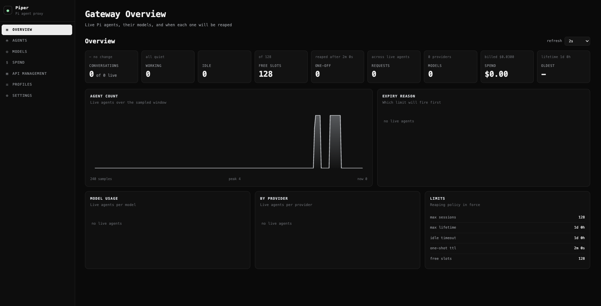

# Piper

**An OpenAI-compatible HTTP gateway in front of the [Pi](https://pi.dev) coding agent.**



Point any OpenAI client — Continue, Cursor, an SDK, `curl` — at this, and Pi answers with its
full agent behind it: its tools, your project context, its skills.

```text
OpenAI client ──HTTP──▶ Piper ──RPC──▶ pi --mode rpc   (one process per conversation, in bwrap or a container)
                          ▲                 │ own workspace · the API key's own profile of skills,
                          │                 │ extensions and settings · no credentials · no network
                          └── model calls ──┘ over a per-session socket; Piper holds the provider keys
```

## Why

Pi is a terminal agent. Its shell, file tools, context files, skills and session memory live in
the CLI. This puts an OpenAI-compatible HTTP surface in front of it without giving any of that up,
and adds the three things a gateway that more than one caller can reach actually needs:

- **Session isolation** — one agent per conversation, never shared, each in its own Pi process.
- **A sandbox per session** — a caller cannot read another session's files, or your credentials,
  and holds no provider key even inside its own sandbox.
- **User control without a shared Pi** — every API key has its own profile of skills, extensions,
  prompts and settings, which its agent can edit and `/reload`, and which no other key sees.
- **Operational control** — a dashboard, settings that live in a database, model fallback, and an
  access log.

It is deliberately small: one file of server code, a plain HTML dashboard, no build step, and no
runtime dependencies beyond Node's standard library and the Pi package you already have.

## Features

- **OpenAI-compatible** — `POST /v1/chat/completions` (streaming and non-streaming) and
  `GET /v1/models`, so clients that know nothing about Pi work unmodified.
- **One agent per conversation** — with session identity you don't have to configure: send
  `X-Session-Id` to pin one, or omit it and the gateway derives a stable key.
- **A sandboxed Pi process per session** — Pi, its tools and its extensions all run inside
  bubblewrap (or a docker/podman container), as `nobody`, with no capabilities, no network and no
  credentials. Model calls cross back to the gateway over a socket only that sandbox can reach.
- **A profile per API key** — skills, extensions, prompts, `AGENTS.md` and settings that persist
  across that key's chats. The agent can create a skill or install an extension, `/reload`, and use
  it; another key never sees it.
- **Chats survive restarts** — a sandboxed chat's Pi session is saved in its workspace, so a
  restart, an eviction or a crash resumes the same agent with its context rather than replaying
  the transcript into a new one.
- **Tool activity in the reasoning stream**, optional — when switched on, each command and file the
  agent touches appears as `▸ bash: ls -la` in `reasoning_content`, which clients such as Open
  WebUI show as "Thinking".
- **Per-key model allow-list** — limit a key to `local-openai/*` or a handful of models; every
  way of choosing a model honours it.
- **A file API for the shared folder** — upload, download, list and delete a key's files over
  HTTP or from the dashboard.
- **Status dashboard** — live agents, their models, when each will be reaped, the model catalogue,
  and an editable settings page. No framework, no CDN.
- **A password on the dashboard** — salted and scrypt-hashed in the database, set or changed from
  the Access Control tab. `GATEWAY_API_KEY` keeps working, so existing scripts are unaffected.
- **Settings in SQLite rather than environment variables**, editable from the dashboard and applied
  without a restart where possible.
- **Model fallback** — when the active model runs out of credit or stops responding, the turn is
  retried once on a configured model and the switch is announced inline in the reply.
- **Reasoning passthrough** — the model's thinking is forwarded as `reasoning_content`, kept out of
  `content` so clients that ignore it are unaffected.
- **Cost tracking** — per-session spend from Pi's own token accounting, plus a ledger in
  `gateway.db` so totals survive a restart, broken down by model — per call, even when a chat
  switches models — and by day.
- **Multiple API keys** — named, optionally expiring, revocable, and each shown only once because
  only a hash is kept. Every request is attributed to the key that made it, with a per-key usage
  report by model and by day.
- **Images**, multi-part content, `reasoning_effort`, and per-request model selection.
- **No dependencies** — Node built-ins plus the installed Pi package. Nothing to install, nothing
  to build.

## Requirements

| | |
| --- | --- |
| Node.js | 22.19 or newer |
| Pi | installed and logged in — `npm install -g --ignore-scripts @earendil-works/pi-coding-agent`, then run `pi` and `/login` |
| bubblewrap | required for the default runner — `apt-get install bubblewrap`, or your distribution's equivalent. Without it, sessions **fail to start** rather than run unsandboxed. Or use `RUNNER=docker`/`podman` with an image built from `Dockerfile.sandbox`. |
| A dedicated user | recommended — the gateway refuses to start as root unless `ALLOW_ROOT=1`. |

## Quick start

Setting it up on a new machine, as a service, behind a proxy: see [DEPLOYMENT.md](DEPLOYMENT.md).

```bash
node server.mjs
# Piper on http://127.0.0.1:8787  cwd=/where/you/ran/it  auth=off  db=.../gateway.db
```

Non-streaming:

```bash
curl -s localhost:8787/v1/chat/completions \
  -H 'content-type: application/json' \
  -d '{"model":"pi","messages":[{"role":"user","content":"List the files here and summarise the project."}]}'
```

Streaming:

```bash
curl -N localhost:8787/v1/chat/completions \
  -H 'content-type: application/json' \
  -d '{"model":"pi","stream":true,"messages":[{"role":"user","content":"Write a haiku about gateways."}]}'
```

Dashboard: <http://localhost:8787/dashboard>

Credentials come from your normal Pi configuration, so run this as the user whose Pi is set up.

## How it works

### One agent per session

A session controller owns one Pi `AgentSession` per session id, each with its own workspace,
context and tool loop. Agents are never shared between ids — that is the point.

Session identity resolves in this order:

1. **`X-Session-Id`** (`session_id`, `X-Conversation-Id` and `conversation_id` work as aliases) —
   if the client sends one.
2. **Derived** from a hash of the client (address, user agent, `user`) plus the **first user
   message**. That is stable across the turns of one chat for any client that replays its
   transcript, so continuity needs no client changes at all.
3. **Minted** as a random UUID, returned in the `X-Session-Id` response header.

Only the **new** user turn is forwarded, because Pi already holds the earlier ones — so don't
resend the transcript on Pi's behalf. A chat whose agent was stopped (a restart, an eviction, a
crash) **resumes** it, as described next. Only a chat with nothing to resume — the first request, an
expired or ended one, a derived key that changed, or the `inprocess` runner — has the client's
earlier turns replayed as a framed transcript ahead of the newest question, so it never silently
loses the conversation.

### Resumable chats

With a sandboxed runner, Pi keeps its session file in the chat's own workspace
(`/workspace/.piper/session`), and the gateway keeps one row per chat in the `chats` table of
`gateway.db`: the key, the workspace, request count and timestamps. The session id itself is a
bearer secret and is stored only as a SHA-256 hash.

Stopping an agent comes in two kinds:

| | What happens | When |
| --- | --- | --- |
| **Hibernate** | the process stops and its spend is recorded; the row and the workspace stay | shutdown (`SIGTERM`/`SIGINT`), LRU eviction, a crashed agent, a profile reset or lock (the chat comes back on the new profile) |
| **End** | the row is deleted and the workspace goes through `WORKSPACE_ON_EXPIRY` | idle, lifetime and one-shot expiry, a dashboard kill |

The next message to a hibernated chat starts Pi in the same workspace with `--continue`: the agent
has its context, its model choice and its files back, and nothing is replayed. The chat keeps its
original age, so `SESSION_MAX_LIFETIME_MS` still ends it on time, and the reaper also ends stored
chats that are past it. On shutdown the gateway stops accepting connections, hibernates every agent
and exits within about five seconds.

### Runners and profiles

`RUNNER` decides where a session's Pi runs:

| Runner | Where Pi runs | Extensions | Credentials visible to the session |
| --- | --- | --- | --- |
| `bwrap` (default) | its own process, inside bubblewrap | the key's own, inside the sandbox | none |
| `docker` / `podman` | its own container from `CONTAINER_IMAGE` | the key's own, inside the container | none |
| `inprocess` | inside the gateway, sharing your `~/.pi/agent` | off unless `GATEWAY_EXTENSIONS` | none through the tools, but they share the process |

With a sandboxed runner, each session is `pi --mode rpc` in its own sandbox, driven over Pi's
RPC protocol. The sandbox sees exactly three things beyond a read-only system: its workspace, its
key's profile, and one Unix socket. Everything Pi runs — built-in tools, skills' scripts, the key's
own extensions — runs in there, so there is no in-process file tool to path-check and no shared
state to leak through.

**No credential enters the sandbox.** `piper-bridge.mjs` is loaded into every sandboxed Pi. It
registers the gateway's model catalogue — names, limits and prices only — as providers whose calls
go over the socket. The gateway looks each model up in its own catalogue, runs the call with its
own credentials (API keys, OAuth, whatever `~/.pi/agent/auth.json` holds), and streams the events
back. The bridge also provides `pi_set_model` and the command behind `/reload`. Since every model
call passes through the gateway, **spend is metered by the gateway**, not reported by the sandbox,
and the ledger cannot be understated by anything running inside.

**A profile per key.** `PROFILE_ROOT/<key>/` is a Pi agent directory — `settings.json`, `skills/`,
`extensions/`, `prompts/`, `AGENTS.md` — mounted read-write at `$PI_CODING_AGENT_DIR` in that key's
sandboxes. It starts from `PROFILE_TEMPLATE` (if set), never from your own `~/.pi/agent`. A new
chat starts on your default model and thinking level as they are in `~/.pi/agent/settings.json`
at that moment, so changing the default in `pi` moves every key along, unless a key has pinned its
own with `/settings set defaultModel <provider/id>`. What the user changes there persists across their chats:

```text
you:   Create a skill in $PI_CODING_AGENT_DIR/skills/release-notes that ...
agent: DONE
you:   /reload
you:   Write the release notes for v2.   ← the skill is used, in this chat and every later one
```

**The catalogue follows your Pi configuration.** The gateway rebuilds its model catalogue when
`models.json`, `auth.json` or `settings.json` in `~/.pi/agent` changes, checked at most every two
seconds, so a model you add or a login you make in `pi` shows up without a restart. Open chats see
it after `/reload`. The Models page has a **reload catalogue** button to force it.

Extensions are `.ts` or `.js` files (or a directory with `index.ts`) in the profile's
`extensions/`; Pi does not discover `.mjs` there. The open gateway and `GATEWAY_API_KEY` each get a
profile of their own, too.

### Shared folder

Every API key also gets a **shared folder**: `files/<key>/` on the host, mounted read-write at
`/workspace/shared` in every one of that key's chats. A file one chat writes there, any other chat
of the same key can read, now or next week. The rest of `/workspace` belongs to one chat and goes
when it ends. The bridge tells each agent this in its system prompt, so agents save lasting work
there on their own.

```text
chat 1:  echo hello > /workspace/shared/note.txt
chat 2:  cat /workspace/shared/note.txt      -> hello      (same key, another chat)
bob:     cat /workspace/shared/note.txt      -> No such file (another key's folder)
```

It is created with the key's first chat, is invisible to every other key, and is kept by a profile
reset (it is data, not configuration). There is no size limit unless you set
`KEY_FILES_MAX_BYTES`. Past that limit, new chats get the folder frozen: they can read it, but what
they write there does not persist until it is trimmed. The Profiles page shows each key's folder
size, and the key's detail view lists its contents, with a download link per file, delete
buttons and an upload control.

**Over HTTP**, with the key as the bearer token, the folder is a small file API:

| Method | Path | Does |
| --- | --- | --- |
| `GET` | `/v1/piper/files` or `/v1/piper/files/<folder>/` (or `?path=<folder>`) | list: name, type, size, modified |
| `GET` | `/v1/piper/files/<path>` | download, streamed |
| `PUT` | `/v1/piper/files/<path>` | upload the request body, streamed; folders are created |
| `DELETE` | `/v1/piper/files/<path>` | delete a file or a folder |

```bash
curl -T report.pdf localhost:8787/v1/piper/files/reports/report.pdf -H "Authorization: Bearer $KEY"
curl -O localhost:8787/v1/piper/files/reports/report.pdf -H "Authorization: Bearer $KEY"
```

Like the profile, the folder is written by sessions and may hold links, so the gateway never opens
it itself: every operation runs `piper-profile.mjs` in a sandbox with only that folder mounted.
Paths are always relative to the folder (a leading `/` means the folder's root), `..` is refused,
and a link is neither served nor followed, whether it is the file or a folder on the way. An upload
goes to a temporary name and replaces the file in one rename; it is capped by
`FILE_UPLOAD_MAX_BYTES` and by what is left of `KEY_FILES_MAX_BYTES`.

### Shared bundles

Skills, extensions and prompts the operator hands out to many keys at once, read-only, on top of
each key's own profile. A bundle is a folder under `SHARED_ROOT` laid out like a Pi package:

```text
shared/
├── base/                     # everyone gets this (the SHARED_BUNDLES default)
│   ├── skills/hallmark/SKILL.md
│   ├── extensions/house.ts
│   └── prompts/review.md
└── security/                 # only for keys given it
    └── skills/pentest-notes/SKILL.md
```

`SHARED_BUNDLES` (Settings → Profiles) is what every key gets: bundle names, `*` for all, or empty
for none; it defaults to `base`. A key can have its own list in the **bundles** column on API
Management (`base,security`, `*`, or `none`; blank follows the default). `GATEWAY_API_KEY` gets
every bundle.

Each granted bundle is mounted read-only into the key's sandbox and loaded as a Pi package, so
its extensions, skills and prompts all load. The rest of `SHARED_ROOT` is masked: a key cannot
see, let alone read, a bundle it was not given. Users cannot change a bundle; edits you make
reach open chats on their next `/reload`, and a changed grant applies to new chats. `/skills`
marks where each skill came from, `(shared: base)`, and the Profiles page lists every bundle's
contents and who gets it.

To share things from your own Pi, copy them in — for example
`cp -r ~/.pi/agent/skills/hallmark shared/base/skills/`. Plain skills and self-contained
extensions work as they are. Two kinds need thought first: an extension that drives a tool or
service on the host will not find it inside the sandbox (nor the network, unless
`SANDBOX_NETWORK=on`), and npm packages that keep state across sessions (`pi-memory`,
`context-mode`) would share it between everyone given the bundle.

### Controlling your profile

Three ways in, all acting on the profile of the key that makes the request — there is no way to
name another key's:

**In chat**, where the gateway answers these itself rather than passing them to the model:

| Command | Does |
| --- | --- |
| `/piper` | lists these commands |
| `/skills` | skills loaded in this chat, from the profile and the workspace |
| `/extensions` | extension files in the profile, and the commands extensions add |
| `/settings` | the profile's `settings.json` |
| `/settings set <key> <value>` | sets one key (value as JSON, else as text) and reloads |
| `/settings unset <key>` | removes one key and reloads |
| `/profile` | size against the quota, contents, and whether it is writable |
| `/profile reset` | asks for `/profile reset confirm`, then starts the profile over |
| `/reload` | re-reads skills, extensions, prompts and settings |

Only these exact names are intercepted: `/skill:name`, prompt templates and extension commands
still go to Pi. The agent can also edit `$PI_CODING_AGENT_DIR` itself when asked.

**Over HTTP**, with the key as the bearer token:

| Method | Path | Body |
| --- | --- | --- |
| `GET` | `/v1/piper/profile` | — summary, size, quota, writable |
| `GET` / `PUT` / `PATCH` | `/v1/piper/profile/settings` | `PUT`: the whole object; `PATCH`: `{"set": {...}, "unset": [...]}` |
| `GET` | `/v1/piper/profile/skills` | — |
| `GET` / `PUT` / `DELETE` | `/v1/piper/profile/skills/<name>` | `PUT`: a bare `SKILL.md` as text, or `{"files": {"SKILL.md": ..., "scripts/x.sh": ...}}` |
| `GET` | `/v1/piper/profile/extensions` | — |
| `GET` / `PUT` / `DELETE` | `/v1/piper/profile/extensions/<name>.ts` | `PUT`: the source as text, or `{"content": ...}` |
| `POST` | `/v1/piper/profile/reset` | `{"confirm": true}` |

```bash
curl -X PUT localhost:8787/v1/piper/profile/skills/release-notes \
  -H "Authorization: Bearer $KEY" -H 'Content-Type: text/markdown' --data-binary @SKILL.md
```

Every change reloads that key's open chats, so it applies to them straight away.

**On the dashboard**, the Profiles view lists every profile with its size, skills and extensions,
and lets the operator **lock** one (read-only, its live agents closed so the lock applies at once)
or **reset** it.

**Locks and quotas.** A profile is frozen when it is locked, or when it has grown past
`PROFILE_MAX_BYTES`. Uploads to a frozen profile are refused, and its sessions get it as a
throwaway overlay: skills and settings load as usual, writes appear to succeed, and nothing
written survives the session. A profile over quota thaws once it is trimmed. A reset archives the
old profile beside the workspace archives, where `WORKSPACE_ARCHIVE_TTL_MS` expires it.

**The gateway never opens a profile's files itself.** A profile is written by its own sessions, so
it may contain anything — including a link such as `settings.json -> ~/.pi/agent/auth.json`, which
would turn "show my settings" into "show your credentials". Reading and editing therefore runs
`piper-profile.mjs` in the same sandbox a session gets, with only that profile mounted, where such
a link leads to a masked path. The dashboard and the quota check see only names and sizes, from
`lstat`, which never follows a link.

A sandboxed Pi that crashes or is killed is replaced on the next request, which resumes its session
file exactly as a hibernated chat does.

### Limits

Two kinds, both applied per sandbox or per key rather than to the gateway as a whole.

**What one sandbox may use.** bubblewrap decides what a session can see, not how much it can
use, so each bwrap sandbox also runs in its own systemd scope: a cgroup with
`SANDBOX_MEMORY_MB` (swap included), `SANDBOX_PIDS` and `SANDBOX_CPUS`. The kernel enforces them
inside that sandbox only:

```text
python3 -c "a = 'x' * 400_000_000"      -> Killed (exit 137); Pi and the chat carry on
for i in $(seq 200); do sleep 20 & done -> fork fails past the process limit
```

When memory runs out, the kernel kills the largest process in the scope — the runaway command, not
Pi — and the scope carries on (`OOMPolicy=continue`). `SANDBOX_LIMITS=auto` uses scopes when
`systemd-run` can create one (as root, the system manager; otherwise `--user`, which needs a user
manager with the memory, pids and cpu controllers delegated) and otherwise runs unlimited, which
the banner and dashboard point out. `systemd` refuses to start sessions rather than run them
unlimited. Containers get `--memory`, `--pids-limit` and `--cpus` instead.

**What one key may use.** `KEY_MAX_SESSIONS` caps a key's live sessions: at the cap, a new chat
closes that key's least recently used idle one, and if all are busy the request gets `429`.
`KEY_DAILY_SPEND_USD` caps what a key may spend per local day, counted from the gateway's own
metering (the ledger since midnight, plus what its live sessions have run up). It is checked when
a request arrives and again by the bridge before every model call, so an agent loop that crosses
the line stops at its next call, with `[model error: daily spend limit reached ...]`. A key over
its cap can still use `/profile` and the other gateway commands; only model calls are refused.
Both defaults can be overridden per key on the API Management page (blank follows the default,
`0` is unlimited). `GATEWAY_API_KEY` is the operator's and is never limited.

With `RUNNER=inprocess` there is no bridge, so the spend cap is checked only when a request
arrives, and there are no per-sandbox resource limits.

### Sandbox

**A sandbox starts empty.** It is not the host's filesystem with the dangerous parts hidden; it is
an empty root with only what an agent needs mounted into it. There is no deny-list to keep
complete, because nothing is there unless it was put there on purpose. What a session sees:

| Path | What it is | Access |
| --- | --- | --- |
| `/workspace` | this chat's workspace — also `HOME` and the working directory | read-write |
| `/profile` | the key's Pi profile (`PI_CODING_AGENT_DIR`): skills, extensions, prompts, settings, packages | read-write (a throwaway overlay when locked or over quota) |
| `/workspace/shared` | the key's shared folder: the same files in every chat of this key | read-write (a throwaway overlay when over `KEY_FILES_MAX_BYTES`) |
| `/shared/<bundle>` | the shared bundles this key was given, and no others | read-only |
| `/usr`, and `/bin`, `/sbin`, `/lib*` as links into it | system binaries and libraries, `/usr/local` included | read-only |
| `/etc` | only `alternatives`, `ld.so.cache`, `ld.so.conf(.d)`, `localtime`, `timezone`, `nsswitch.conf`, `hosts`, `resolv.conf`, `ssl/certs`, `ssl/openssl.cnf`, `mime.types`, `protocols`, `services`, `os-release`, and a generated two-line `passwd` and `group` | read-only |
| `/opt/node`, `/opt/piper` | the Node/Pi runtime, and the model bridge | read-only |
| `/run/piper/bridge.sock` | the one way out: model calls to the gateway | socket |
| `/tmp`, `/var/tmp`, `/run` | private and empty | read-write |
| `/dev`, `/proc` | minimal devices; only the sandbox's own processes | — |
| `SANDBOX_ALLOW` entries | extra toolchains you name, at their own path | read-only |

Nothing else exists inside: no `/home`, `/root`, `/var/lib`, `/srv`, `/mnt`, `/sys`, no other
`/opt` software, no other key's profile, no other chat's workspace. The fixed paths also mean no host
path — your username, where the gateway lives — ever appears in a prompt, a tool result or
`/skills`. They are the same paths the container runners use.

Around that view:

- every command runs as `nobody` in its own **user namespace with every capability dropped**
  (`--unshare-user --cap-drop ALL`), so nothing inside can mount, unmount or remount anything;
- the network is an **empty namespace** unless `SANDBOX_NETWORK=on`: no internet, no LAN, no cloud
  metadata endpoint, and no route back to this gateway's dashboard. Model calls work either way,
  through the bridge. With it on, the `/etc` files above are enough for DNS and HTTPS;
- the environment is **cleared** and rebuilt from `PATH`, `HOME`, `TERM`, `LANG` and the few Pi
  variables. bubblewrap inherits by default, which would hand a session every credential the
  gateway was started with;
- the process count, memory and CPU are capped per sandbox (see Limits).

**Toolchains outside `/usr` are not visible** — anything in `/opt`, `~/.cargo/bin`,
`~/.local/bin` and the like. Name the ones sessions should have in `SANDBOX_ALLOW` (Settings →
Sandbox → Extra readable paths). An entry that is or contains something protected — `/root`,
`/etc`, `/etc/ssh`, the gateway's own folders, your `~/.pi/agent` — is ignored rather than mounted.
The one exception is `~/.pi/agent/bin`, which holds only the `fd` and `rg` Pi uses for its find
and grep tools. Tools that need to be told where they live get it through `SANDBOX_ENV`
(`RUSTUP_HOME=/root/.rustup`).

Verified against a live agent:

```text
ls /                        -> bin dev etc lib lib32 lib64 opt proc profile run sbin shared tmp usr var workspace
ls /etc                     -> 16 entries; cat /etc/passwd -> root and nobody only
ls /opt; ls /shared         -> node piper; base            (only the granted bundle)
ls /root /home /var/lib /mnt /sys /srv -> No such file or directory
pwd; echo $HOME             -> /workspace /workspace
python3, node, git, awk     -> all run
touch /shared/base/x        -> Read-only file system
write /profile/skills/…     -> lands in the key's profile; /reload loads it
curl https://example.com    -> 200 with SANDBOX_NETWORK=on; no network otherwise
id -u                       -> 65534
```

**With `RUNNER=inprocess`** Pi itself runs in the gateway, so only its `bash` is sandboxed — the
same empty root, but with the workspace at its host path, because that Pi hands commands absolute
host paths. Its file tools (`read`, `write`, `edit`, `ls`, `grep`, `find`) run in the gateway
process and are held to the workspace (plus `SANDBOX_ALLOW`) by a path check, which is a check, not
a boundary. `WORKSPACE_JAIL=off` turns both off; the banner and dashboard say so while it is.

**Do not run the gateway as root.** It refuses to start as root unless `ALLOW_ROOT=1`. The sandbox
holds either way, but a dedicated user adds ordinary file permissions behind it.

### Workspace lifecycle

`WORKSPACE_ON_EXPIRY` decides what happens when a session ends, and every ending funnels through
one place: idle, lifetime and one-shot reaping, LRU eviction, a dashboard kill, shutdown, and a
request rejected before its agent ran.

| Value | Behaviour |
| --- | --- |
| `archive` (default) | moved to `<WORKSPACE_ROOT>-archive/<uuid>-<timestamp>` — a rename, never a copy |
| `delete` | removed |
| `keep` | left where it is |

An untouched workspace is always removed whatever the policy, and archives expire after
`WORKSPACE_ARCHIVE_TTL_MS`.

### Session lifetime

Sessions are disposed by whichever of these comes first: the hard lifetime, the idle timeout, the
one-shot rule (used exactly once, then quiet), or LRU eviction past the count cap. A session with a
request in flight is never reaped or evicted out from under it.

Live agents are in memory, and chats that can resume are in the `chats` table. The startup and
periodic sweeps treat any other workspace on disk as an orphan and apply the policy to it; a
workspace with a `chats` row is kept for its chat. Directories touched in the last minute are skipped, so a second instance starting up
cannot reap a running one's work.

### Model fallback

When a model call fails in a way a different model could survive, the turn is retried once on
`FALLBACK_MODEL` and the switch is announced inline:

```text
[model fallback: opencode-go/deepseek-v4-flash failed (quota: insufficient_quota) - switched
 to opencode-go/deepseek-v4.1-flash for this session]

PONG
```

A failed model call is not an exception — it is a message with `stopReason: "error"`, which the
gateway inspects. `quota` errors (credit exhausted) are permanent for the account; `transient` ones
only reach us once Pi has already exhausted its own retries. Anything else is a deterministic
request problem that a different model would not fix, so it is not retried. `FALLBACK_MODE` decides
whether the switch lasts for the session, just the request, or a cooldown.

When no fallback applies — none is configured, or the error is not one another model would fix —
the failure is reported inline as `[model error: provider/model: ...]` rather than as an empty reply.

### Tool activity

Optional, and off by default. Turn on **Show tool output in the stream** (Settings → Sessions, or
`STREAM_TOOL_ACTIVITY`) and every tool the agent starts is announced in the reasoning stream, one
line each, with a failed one marked:

```text
▸ bash: ls -la /workspace/shared
▸ read: /workspace/notes.md
▸ web_search: {"query":"pi coding agent"}
  ✗ web_search failed
```

The summary is the command for `bash`, the path for the file tools and compact JSON for anything
else (file contents left out), truncated to 200 characters. It goes to `reasoning_content`, never to
`content`, so a client that ignores reasoning sees no change. The switch applies from the next
request, including in chats already open.

### Spend

Cost is read from Pi rather than estimated. `getSessionStats()` reports a session's cost and token
counts, aggregated over every entry including history that was compacted away, so the figure is what
was actually billed rather than a local guess. Tiered pricing is handled inside Pi too.

Two numbers, because they answer different questions:

- **Live** — what the sessions currently in memory have spent so far. Immediate, and shown per
  agent in the Agents table and on the Overview card.
- **The ledger** — a `spend` table in `gateway.db`, written once as a session closes. Close is the
  single funnel for every way a session can end — reaped, killed, evicted, or shut down — so one
  hook covers them all. A hibernated chat is recorded when it hibernates, and again for what it
  spends after it resumes. It survives a restart, which is what makes *today*, *per model* and
  *per day* mean anything.

Every model call is metered with its model, so a chat that switched models is recorded as one row
per model, and the per-model figures are exact rather than billed to whichever model came last.
(The `inprocess` runner reports one total, recorded against its last model.)

A session that generated nothing is not recorded: a request rejected before it reached the model
cost nothing and would only add noise. Tokens are recorded even when the cost is zero, so a local
provider shows its usage at `$0.00` rather than showing nothing.

### Dashboard password

The dashboard has its own password, independent of `GATEWAY_API_KEY` so that protecting it does not
change what the OpenAI endpoints require. With no password stored the dashboard stays open, exactly
as before — set one from **Settings → Access Control**.

- **It is hashed, not encrypted.** Salted and hashed with `scrypt` (N=16384, r=8, p=1), compared
  with `timingSafeEqual`. Nothing ever reads it back; the page is only told whether one is set.
  Reversible encryption would need its key stored beside the ciphertext, which protects nothing a
  hash does not protect better.
- **A sign-in is a signed cookie.** It carries its issue time plus an HMAC of that time, keyed on
  the stored hash. That one choice buys three properties at once: an edited cookie cannot validate,
  changing the password ends every other session, and a restart does not sign you out.
- **Everything under `/dashboard` is behind it** — the page, all five JSON endpoints, and the
  mutating ones (`POST /dashboard/settings`, `kill-all`, `DELETE /dashboard/session/:fp`). `/v1/*`
  and `/health` are untouched, and a `Bearer` header is still accepted on the dashboard whenever
  `GATEWAY_API_KEY` is set, so scripts that already send one keep working.
- **Wrong passwords are throttled** per client: five free attempts, then an exponential wait capped
  at five minutes, answered as `429` with `Retry-After`. The same counter guards the
  current-password field, so a stolen cookie is not a fast way to guess one.
- **Forgetting it does not lock you out.** Start the gateway with `DASHBOARD_PASSWORD` set and the
  stored hash is replaced on startup. Only the hash is written, so unset the variable afterwards.

### API keys

`GATEWAY_API_KEY` remains a single always-valid key, and the **API Management** page adds as many
more as you like. A key has a name, an optional expiry, and one of four states:

| State | Meaning |
| --- | --- |
| `active` | Authenticates `/v1/*`. |
| `expired` | Past its date; kept so its usage stays attributed. Extending the date revives it. |
| `revoked` | Switched off deliberately. Usage history stays. Different from deleting. |
| `deleted` | The row is gone but its ledger rows are not, so usage reads `(deleted key)`. |

- **The value is shown once.** Only `sha256(key)` and a 14-character display prefix are stored, so the
  page can list `piper_a1b2c3d4…` but can never show the key again. Lost means issuing a new one. A
  256-bit random key has nothing to guess, so this hash is deliberately a fast SHA-256 rather than the
  password's slow scrypt: it is verified on every request, and blocking the event loop for tens of
  milliseconds each time would stall concurrent streams to slow down a value that cannot be guessed.
- **Keys authenticate `/v1/*` only.** The dashboard answers to its own password, and
  `GATEWAY_API_KEY` is the one credential that opens both — otherwise every API key you hand out
  would also be able to `POST /dashboard/settings` and turn the sandbox off.
- **While any key row exists, `/v1/*` requires one**, including revoked and expired rows. Revoking
  your last key therefore locks the API rather than quietly opening it; delete every key to reopen.
- **Usage is attributed to the key that opened the session**, recorded once at creation: a session
  continued by a different key stays with its original. Revoking a key does not stop sessions it has
  already opened — it stops new requests.
- **Expiry is a date, or never.** A date means valid *through* that day, so picking today is not
  instantly expired. A later date extends it; clearing it means never.

**Allowed models.** `KEY_ALLOWED_MODELS` limits which models keys may use, and a key's detail view
on Profiles overrides it for that key. It is a comma-separated list of `provider/model` patterns
where `*` matches anything, e.g. `local-openai/*, github-copilot/gpt-5-mini`; empty allows every
model. It applies everywhere a model is chosen: `/v1/models` lists only allowed ones, a request
naming another gets `400 model_not_allowed`, the sandbox's own catalogue omits the rest, so
`pi_set_model` and `/model` cannot reach them, and the bridge refuses a call to one outright.
`GATEWAY_API_KEY` is never limited.

The **Keys** table also shows each key's live sessions and today's spend against its limits, with
fields to override them (see Limits).

The **Usage** tab reports per key — requests, tokens, cost, last used — a per-model drill-down for
each key, and a per-day series for the page. Those figures come from the spend ledger, written when a
session closes, so anything still running is marked `live` in its row instead of being folded into
numbers that would then disagree with the per-model and per-day breakdowns beside them.

## Endpoints

| Method | Path | Purpose |
| --- | --- | --- |
| `POST` | `/v1/chat/completions` | Chat completions, streaming or not |
| `GET` | `/v1/models` | Model list |
| `GET` / `PUT` / `DELETE` | `/v1/piper/files/...` | The key's shared folder (see Shared folder) |
| `*` | `/v1/piper/profile/...` | The key's profile (see Controlling your profile) |
| `GET` | `/health` | Liveness and session counts (unauthenticated) |
| `GET` | `/dashboard` | Status dashboard, or the sign-in page when locked |
| `POST` | `/dashboard/login` | Sign in; sets the session cookie |
| `POST` | `/dashboard/logout` | Clear the session cookie |
| `POST` | `/dashboard/password` | Set, change or remove the dashboard password |
| `GET` | `/dashboard/api-keys.json` | List keys (prefixes only) |
| `POST` | `/dashboard/api-keys` | Mint a key; returns the value once |
| `POST` | `/dashboard/api-keys/:id` | Rename, or set a new expiry |
| `POST` | `/dashboard/api-keys/:id/revoke` | Revoke, keeping the row and its usage |
| `DELETE` | `/dashboard/api-keys/:id` | Delete the row |
| `*` | `/v1/piper/profile/...` | The calling key's own profile; see Controlling your profile |
| `GET` | `/dashboard/profiles.json` | Every profile: size, skills, extensions, lock state |
| `POST` | `/dashboard/profiles/:scope/lock` | `{"locked": true}` freezes a profile and closes its agents |
| `POST` | `/dashboard/profiles/:scope/reset` | Archive a profile and start it over |
| `GET` | `/dashboard/profiles/:scope.json` | Everything one key's agents get: own profile, granted bundles, and a running agent's loaded tools and commands |
| `GET` | `/dashboard/files/:scope/:path` | Download a file from a key's shared folder |
| `PUT` / `DELETE` | `/dashboard/files/:scope/:path` | Upload to, or delete from, a key's shared folder |
| `GET` | `/dashboard/api-keys/usage.json` | Per-key usage, per model and per day |
| `GET` | `/dashboard.json` | The same data as JSON |
| `GET` | `/dashboard/models.json` | Model catalogue |
| `POST` | `/dashboard/models/reload` | Rebuild the catalogue from `~/.pi/agent` now |
| `GET` | `/dashboard/spend.json` | Spend ledger: totals, per model, per day |
| `GET` | `/dashboard/settings.json` | Current settings |
| `POST` | `/dashboard/settings` | Update settings |
| `DELETE` | `/dashboard/session/:fingerprint` | Close one session |
| `POST` | `/dashboard/kill-all` | Close every session |

## Configuration

Settings live in SQLite (`gateway.db` beside `server.mjs`, override with `GATEWAY_DB`) and are
editable at `/dashboard#settings`, grouped by purpose into **Sandbox**, **Sessions**, **Usage limits**,
**Profiles**, **Models**, **Access** and **Server** tabs (link one directly as `#settings/sandbox`). `GATEWAY_DB` is the only environment variable that seeds a setting: every
 knob below is read from its environment variable on first run, and the stored row wins from then
on — so a value you change in the dashboard is not silently overridden by the shell that launched
the gateway. `DASHBOARD_PASSWORD` is the one exception, and deliberately so: it replaces the stored
password hash on every startup, which is what makes it a recovery path rather than a seed.

Durations accept `90s`, `10m`, `24h`, `2d`, or a plain millisecond count. Every value is validated
on write, so a bad one is rejected with a message rather than reaching the running config.

| Group | Setting | Default | Meaning |
| --- | --- | --- | --- |
| Network | `HOST` / `PORT` | `127.0.0.1` / `8787` | Listen address. `0.0.0.0` exposes it. *Restart.* |
| Security | `GATEWAY_API_KEY` | unset | When set, requests must send `Authorization: Bearer <key>`. |
| Access Control | `DASHBOARD_SESSION_MS` | `12h` | How long a dashboard sign-in lasts. `0` keeps it until the browser closes. |
| Sessions | `MAX_SESSIONS` | `128` | Cap on live sessions; the least-recently-used is disposed past it. |
| Sessions | `SESSION_MAX_LIFETIME_MS` | `1d` | Hard lifetime, measured from when the session was spawned. |
| Sessions | `SESSION_IDLE_MS` | `10m` | Disposed after this long without a request. |
| Sessions | `ONE_SHOT_TTL_MS` | `2m` | Close a session used exactly once and then quiet this long. `0` disables. |
| Limits | `BODY_LIMIT` | `33554432` | Largest accepted request body, in bytes. |
| Limits | `MAX_IMAGE_BYTES` | `20971520` | Largest image the gateway will fetch, in bytes. |
| Limits | `ALLOW_IMAGE_URLS` | off | Fetch `http(s)` image URLs. Off accepts `data:` URIs only. When on, internal addresses are refused and redirects are not followed. |
| Agent | `PI_CWD` | process cwd | Used only when per-session workspaces are disabled. |
| Agent | `PI_AGENT_PACKAGE` | auto | Path to the Pi package when it cannot be resolved automatically. *Restart.* |
| Agent | `RUNNER` | `bwrap` | `bwrap`, `docker`, `podman` or `inprocess`. See Runners and profiles. Applies to new sessions. |
| Agent | `PROFILE_ROOT` | `<gateway>/profiles` | Where each key's Pi profile lives. |
| Agent | `PROFILE_TEMPLATE` | empty | A directory copied into a key's profile when it is first created. |
| Limits | `KEY_MAX_SESSIONS` | `16` | Live sessions per key. `0` is unlimited. Overridable per key. |
| Limits | `KEY_ALLOWED_MODELS` | empty | Models keys may use: `provider/model` patterns, `*` as a wildcard. Empty allows all. Overridable per key. |
| Limits | `FILE_UPLOAD_MAX_BYTES` | `1073741824` | Largest file accepted by the shared-folder file API, in bytes. `0` is unlimited. |
| Limits | `KEY_DAILY_SPEND_USD` | `0` | Daily spend cap per key, in USD. `0` is unlimited. Overridable per key. |
| Limits | `SANDBOX_LIMITS` | `auto` | `auto`, `systemd` or `off`: how bwrap sandboxes get the resource limits below. |
| Limits | `SANDBOX_MEMORY_MB` | `2048` | Memory per sandbox, swap included. `0` is unlimited. |
| Limits | `SANDBOX_PIDS` | `512` | Processes and threads per sandbox. `0` is unlimited. |
| Limits | `SANDBOX_CPUS` | `2` | CPU cores per sandbox, fractions allowed. `0` is unlimited. |
| Agent | `KEY_FILES_ROOT` | `<gateway>/files` | Where each key's shared folder lives. |
| Agent | `KEY_FILES_MAX_BYTES` | `0` | Shared folder size limit in bytes; past it the folder is frozen for new chats. `0` is unlimited. |
| Agent | `SHARED_ROOT` | `<gateway>/shared` | Folder of shared bundles. |
| Agent | `SHARED_BUNDLES` | `base` | Bundles every key gets: names, `*` for all, or empty. Overridable per key. |
| Agent | `PROFILE_MAX_BYTES` | `104857600` | Profile size limit in bytes; past it uploads are refused and the profile is frozen. `0` is unlimited. |
| Agent | `CONTAINER_IMAGE` | `piper-sandbox` | Image for the container runners, built from `Dockerfile.sandbox`. |
| Agent | `GATEWAY_EXTENSIONS` | off | `inprocess` only: load Pi extensions for sessions. See Security. |
| Logging | `ACCESS_LOG` | on | One line per request to stderr. |
| Sessions | `STREAM_TOOL_ACTIVITY` | off | Announce each tool the agent runs, with its command or file, in `reasoning_content`. |
| Fallback | `FALLBACK_MODEL` | unset | `provider/model` to retry a failed turn on. Validated against the catalogue. |
| Fallback | `FALLBACK_MODE` | `session` | `session`, `request` or `cooldown` — how soon the primary is tried again. |
| Fallback | `FALLBACK_COOLDOWN_MS` | `5m` | How long to stay on the fallback in `cooldown` mode. |
| Workspaces | `WORKSPACE_ROOT` | `<gateway>/workspaces` | Root for per-session directories. Empty disables the jail. |
| Workspaces | `SANDBOX_ENV` | empty | `NAME=value` pairs set inside every sandbox, for tools that need them (`RUSTUP_HOME=/root/.rustup`). Cannot override `PATH`, `HOME`, `TERM`, `LANG`, `PI_*` or `PIPER_*`. |
| Workspaces | `SANDBOX_ALLOW` | empty | Colon-separated folders or files mounted read-only in every sandbox at the same path — toolchains outside `/usr`, such as `/opt/x` or `~/.cargo/bin`. Protected paths are ignored. |
| Workspaces | `SANDBOX_NETWORK` | `off` | `off` gives each command an empty network namespace; `on` shares the host network. |
| Workspaces | `WORKSPACE_JAIL` | on | Confine sessions: bubblewrap for `bash`, path checks for the file tools. **Off means no sandbox at all.** |
| Workspaces | `WORKSPACE_ON_EXPIRY` | `archive` | `archive`, `delete` or `keep`. |
| Workspaces | `WORKSPACE_ARCHIVE_TTL_MS` | `30d` | Delete archives older than this. `0` keeps them forever. |

**Pi keeps its own config.** `~/.pi/agent/settings.json`, `auth.json`, `models.json` and
`trust.json` are read by the Pi SDK directly and are deliberately left alone — folding them into
this database would break the agent. Only the gateway's own settings are stored here.

## Dashboard

Seven views behind a hash route:

- **Overview** — live count, model usage, expiry reasons, and the reaping policy in force.
- **Agents** — every live session with its model, age, last use, expiry and a kill control.
  **Conversations** are separated from **one-off** generations: a client that fires auxiliary
  requests alongside a chat (a title, a summary, suggested follow-ups) sends each as a bare
  single-message request, and each really is a separate generation. There is no way to tell one
  apart from a brand-new chat on the wire, so a chat counts as one-off until its second turn.
- **Models** — the catalogue, one tab per provider, with capabilities, context window and cost,
  and a **reload catalogue** button.
- **Spend** — what agents have cost: today, all time, per model and per day, from the ledger, with
  what the live agents have spent so far shown alongside.
- **Profiles** — each key's profile: size against the quota, skills, extensions, live agents, and
  lock and reset controls. Click a key (or **contents** on API Management, or open
  `#profiles/key-<id>`) for everything that key's agents get, in three parts:
  - **installed by the user** — their own skills, extensions, prompts, agent definitions
    (`agents/*.md`), packages and an `AGENTS.md` preview, read through the sandboxed helper;
  - **shared bundles** — each bundle the key is given, with its contents;
  - **loaded in a running agent** — every tool and command that agent actually has, labelled by
    where it came from (own, shared bundle, workspace, gateway, built into Pi). Tools exist only
    once extensions have started, so this part appears while one of the key's agents is running;
    it is fetched through the bridge and never touches the conversation.
- **Settings** — every setting, in tabs by purpose with titled sections. Each field has a
  plain-language label (the setting's key underneath), a one-line summary, units, and the full
  explanation under *details*. Settings that do nothing with the current choices — container
  options when the runner is bubblewrap, the fallback cooldown with no fallback model — are dimmed
  with a note saying when they apply, and follow unsaved changes live. There is a search across
  every tab, a per-field *default* button, and a save bar that counts unsaved changes; a rejected
  value takes you to its field. `restart` marks what needs a restart. The **Access** tab holds the
  dashboard password and its session lifetime.

When a password is set, opening the dashboard asks for it first; a session that expires mid-view
reloads into the sign-in page instead of showing an error banner.

Session ids are never shown. Rows carry an 8-character fingerprint, and the kill control targets
that: the server resolves it to the real id internally, so the page never holds a usable
credential. Session ids are treated as bearer secrets — never logged, never listed.

## Security

Read this before exposing the port. The agent runs real tools with the privileges of the user that
started the gateway.

- **Bind to localhost unless you have a reason not to.** The default is `127.0.0.1` and
  authentication is off. `HOST=0.0.0.0` plus no API key means anyone who can reach the port can
  run an agent as you.
- **With `SANDBOX_NETWORK=on`, a session can reach this gateway's own API.** An agent could then
  call `/dashboard/settings` and reconfigure the gateway — including turning off its own jail — if
  the gateway is reachable and unauthenticated. Set a dashboard password, or `GATEWAY_API_KEY`, and
  it gets 401s instead. Neither secret is readable from the sandbox (`gateway.db` is not mounted and
  `/proc` is a fresh namespace). With the default `off` there is no route at all.
- **Sessions are scoped to the credential that uses them.** A session id — sent, derived or minted
  — is stored under the key that presented it, so the same id under another key is a different,
  fresh session. Behind a proxy that serves many people from one address, two users who open with
  the same message used to derive the same agent; they no longer can, as long as each has a key.
  Users sharing one key still share its namespace.
- **Image URLs are fetched by the gateway, outside the sandbox**, so they are off by default
  (`ALLOW_IMAGE_URLS`). When enabled, loopback, private, link-local and metadata addresses are
  refused at connection time, which also defeats DNS rebinding.
- **The dashboard password crosses the wire in clear text.** The cookie is `HttpOnly` and
  `SameSite=Strict`, and `Secure` is added when `X-Forwarded-Proto: https` says something in front
  terminated TLS — but over plain HTTP on a network, the password is readable in transit. This is
  the same caveat as `GATEWAY_API_KEY`.
- **`gateway.db` holds no readable secret.** `GATEWAY_API_KEY` is stored as a scrypt hash (a
  plaintext value from an older database is hashed in place on first load), and the dashboard password
  and every API key were already hashes. It is created `chmod 600` and should still not be committed
  or copied around, but a copy no longer hands over a usable credential. The settings page never
  receives any of them back.
- **`WORKSPACE_JAIL=off` removes the sandbox entirely, and once did so silently.** Anyone able to
  reach an unauthenticated dashboard can switch it off — including an agent, whose own jail that is
  — so set a dashboard password or `GATEWAY_API_KEY`. The banner and the dashboard now say so when it
  is off.
- **Extensions are safe only in a sandboxed runner.** There a key's extensions run inside its own
  sandbox and can harm nothing but that sandbox and that key's profile. With `RUNNER=inprocess`
  they run in the gateway process: `pi-memory`, for one, appends to a shared `MEMORY.md` that the
  next session reads back. So `inprocess` keeps extensions **off** unless `GATEWAY_EXTENSIONS=1`,
  and that must not be combined with per-session workspaces — a project extension written by an
  agent would then execute in the gateway.
- **The bridge socket is the sandbox's only way out**, and it only answers model calls: the model
  is looked up by name in the gateway's catalogue, and only sampling options are taken from the
  sandbox — never a URL, header or key. Anything a key can do through it, it could do by chatting.
- **A profile is shared by a key's concurrent chats.** Two chats on one key see each other's
  profile changes. Issue one key per person if people should not share skills or settings.
- **`RUNNER=inprocess` isolates conversation state, not the filesystem.** Separate agents cannot
  read each other's history, and the sandbox hides sibling workspaces — but they share one process,
  one user and one filesystem. Use a sandboxed runner for anyone but yourself.

## Limitations

Honest list of what this does not do:

- **`/usr` stays readable.** It is system software, not user data, and it is what lets binaries run.
  That includes `/usr/local`, so anything installed there (pip tools, for one) is visible. Everything
  else of the host — home directories, `/var`, `/opt`, `/etc` beyond its short list — is absent.
- **A toolchain outside `/usr` needs `SANDBOX_ALLOW`**, whether it lives in `/opt` or under a home
  directory (`~/.cargo/bin`, `~/.local/bin`). The gateway's own runtime is added automatically. An
  allow path that is or contains something protected is ignored.
- **With `RUNNER=inprocess`, the file tools' path check is a check, not a boundary.** It runs in the
  gateway process, so a symlink swapped by a concurrent `bash` call between the check and the read
  could win the race. The sandboxed runners have no such check to race: the tools run inside.
- **The container runners are untested against a real engine here.** Their arguments are unit
  tested; build `Dockerfile.sandbox` with the Pi version the gateway runs and try one chat first.
  With rootful Docker and a gateway running as root, the container runs as uid 0 with no
  capabilities; a dedicated gateway user, or rootless podman, avoids that.
- **A sandboxed session costs a process.** Pi starts in about a second and idles at roughly 100 MB;
  `MAX_SESSIONS` is also a cap on processes, and `SANDBOX_MEMORY_MB` must leave room for Pi itself.
- **A spend cap stops the next call, not the current one.** A single model call that starts under
  the cap is allowed to finish, so a key can end the day slightly over it.
- **"Today" is the gateway's local day**, and a session is billed to the day it closes.
- **A sandbox that fails to start answers `503`** with the reason (no bubblewrap, a broken image,
  a limit systemd refused), and the next request tries a fresh one.
- **`/proc` is closed to the file tools.** They run inside the gateway process, so `/proc/self` would
  be the gateway. `bash` still has a real `/proc` in its own namespace if a task needs `cpuinfo` or
  `mounts`.
- **Only sandboxed chats resume.** With `RUNNER=inprocess` a restart or eviction still costs a
  transcript replay, and with `WORKSPACE_ON_EXPIRY=delete` a restart removes those chats'
  workspaces.
- **A resumed chat is a new process.** It gets a fresh meter and a fresh ledger row, and whatever
  was running in its shell (a server started in the background) is gone.
- **Audio is rejected** with a 400. Pi's model type declares only `text` and `image` input, and
  there is no audio content type in its API.
- **Signing out is client-side.** The cookie is stateless, so logging out clears it in the browser
  but a copy taken beforehand stays valid until `DASHBOARD_SESSION_MS` elapses. Changing the
  password is what invalidates every outstanding session immediately.
- **An API key cannot be recovered once the page is left.** Only its hash is stored, by design. If it
  is lost, issue a new one — and update clients in the same window so they never have a gap.
- **Revoking a key does not close the sessions it opened.** They finish normally and their usage is
  still billed to it; only new requests are refused.
- **Usage is attributed at session creation**, when the ledger row is eventually written. A key that
  continues somebody else's session is not credited for it.
- **Spend is only as precise as the provider's pricing.** Providers priced at zero — the local ones
  — report `$0.00` however much they are used, though their tokens are still recorded. Cost covers
  model calls only; tool execution is local and free.
- **No `/v1/responses`, embeddings, or `n` > 1.** Tool calls are executed by the agent and are not
  surfaced as OpenAI `tool_calls`; you get the agent's text back.
- **`prompt_tokens` is a session delta**, so it includes Pi's own system prompt and tool context.

## Development

```bash
node test.mjs
```

The suite covers the pure logic — conversation mapping, session identity, model resolution and
error classification, the settings coercion, the sandbox command's argument order, the path guard
including symlink escapes, the workspace lifecycle policies against a real filesystem, the
spend ledger's aggregation and its refusal to record a session that generated nothing, the password
hashing including malformed rows, the route guard — which has to recognise every `/dashboard`
path, because a route it misses is served to anyone who asks — the API key store's hashing, expiry,
revocation and delete semantics, the shape of the credential chain from the request down to the
ledger row, and the sandbox's empty-root view, which must mount nothing of the host beyond `/usr`, a
short `/etc` list and what the session is given, and must never accept an allow path that
re-exposes the gateway. It also covers resumable chats (hibernate keeps the row, end deletes it,
resume passes `--continue`), graceful shutdown, catalogue reload, tool-activity summaries,
per-model metering, the model allow-list, and the file helper's streaming and path safety, links
included. It points its database and workspace root at scratch paths, so running it never touches a real
`gateway.db` or a live session's workspace.

The code is split by concern: `server.mjs` is the entry point and router, and `lib/` holds
`settings`, `auth`, `sandbox`, `models`, `sessions`, `runner`, `chat`, `profiles` and `dashboard`.
`piper-bridge.mjs` is the extension loaded into every sandboxed Pi, and `piper-profile.mjs` is the
helper that reads and writes profiles and shared folders inside a sandbox.

The dashboard is `dashboard.html`, served from disk on each request — edit and refresh, no restart
and no build step.

## License

Copyright 2026 ALange

Licensed under the Apache License, Version 2.0; see [LICENSE](LICENSE). You may not use these files
except in compliance with the License. Unless required by applicable law or agreed to in writing,
software distributed under the License is distributed on an "AS IS" BASIS, WITHOUT WARRANTIES OR
CONDITIONS OF ANY KIND, either express or implied.
